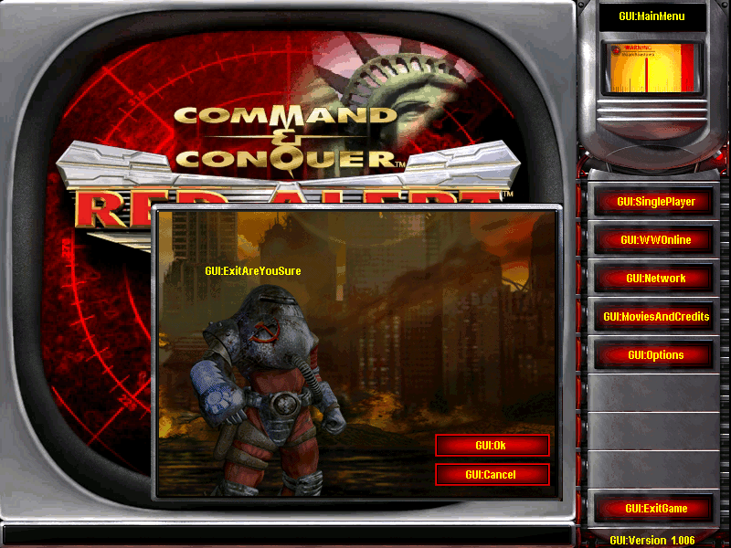

# ra2csf

A Python library for reading, writing, and updating [`.csf`](https://modenc.renegadeprojects.com/CSF) files from [Command & Conquer: Red Alert 2](https://en.wikipedia.org/wiki/Command_%26_Conquer:_Red_Alert_2) and [Command & Conquer: Yuri's Revenge](https://en.wikipedia.org/wiki/Command_%26_Conquer:_Yuri%27s_Revenge).



[](https://github.com/jet-logic/ra2csf/stargazers) [](https://pypi.org/project/ra2csf/) [](https://github.com/jet-logic/ra2csf/actions/workflows/tests.yml) [](https://github.com/jet-logic/ra2csf/actions/workflows/publish.yml)

## Installation

```bash
pip install ra2csf
```

## ☕ Support

If you find this project helpful, consider supporting me:

[](https://ko-fi.com/B0B01E8SY7)

## Overview

CSF (Command String File) files contain localized text strings used in Red Alert 2 and Yuri's Revenge. This library provides simple functions to load, dump, and update these files.

## Core Functions

### `ra2csf.load(file)`

Load a CSF file and return a dictionary mapping string labels to their values.

**Parameters:**

- `file` - Path to CSF file (str) or file-like object

**Returns:** `dict[str, str]` - Dictionary where keys are label names and values are the corresponding text strings.

**Example:**

```python
import ra2csf

# Load from file path
strings = ra2csf.load("ra2.csf")
print(strings["NAME: Soviet War Factory"])
# Output: "Soviet War Factory"

# Load from file object
with open("ra2.csf", "rb") as f:
    strings = ra2csf.load(f)
```

### `ra2csf.dump(strmap, file)`

Write a dictionary of strings to a CSF file.

**Parameters:**

- `strmap` - Dictionary mapping label names (str) to text values (str)
- `file` - Output path (str) or writable file-like object

**Example:**

```python
import ra2csf

new_strings = {
    "NAME: Soviet War Factory": "Soviet War Factory",
    "DESC: Soviet War Factory": "Produces heavy vehicles",
    "NAME: Tesla Reactor": "Tesla Reactor",
}

ra2csf.dump(new_strings, "custom.csf")
```

### `ra2csf.update(file, strmap)`

Update an existing CSF file with new or modified strings. Existing strings not in the update map remain unchanged.

**Parameters:**

- `file` - Path to existing CSF file (str)
- `strmap` - Dictionary of label names and values to add or modify

**Example:**

```python
import ra2csf

# Update specific strings
ra2csf.update("ra2.csf", {
    "NAME: Soviet War Factory": "Soviet Tank Factory",
    "NAME: New Unit": "Apocalypse Tank",
})
```

## Complete Example

```python
import ra2csf

# Load original
strings = ra2csf.load("original.csf")

# Make modifications
strings["NAME: Tesla Coil"] = "Tesla Tower"

# Save to new file
ra2csf.dump(strings, "modified.csf")

# Or update in-place
ra2csf.update("original.csf", {
    "NAME: Tesla Coil": "Tesla Tower"
})
```

## Advanced Usage

### Loading with Extra Data

The `load` function handles both standard entries (with ` RTS` label) and extra data entries (with `WRTS` label), but returns only the string values by default.

### Custom File Objects

All functions accept either file paths or file-like objects:

```python
import io
import ra2csf

# Using BytesIO
buffer = io.BytesIO()
ra2csf.dump({"LABEL": "Text"}, buffer)
buffer.seek(0)
loaded = ra2csf.load(buffer)
```

## Command-Line Interface

The `ra2csf` CLI provides three main commands for working with CSF files.

### Overview

```bash
ra2csf {dump,merge,update} [arguments]
```

---

## Commands

### `dump` - Export CSF to JSON/YAML

Convert a CSF file to human-readable JSON or YAML format.

```bash
ra2csf dump [--format json|yaml] <csf_file> <output_file>
```

**Aliases:** `d`

**Options:**

- `-f, --format` - Output format (`json` or `yaml`, default: `json`)

**Examples:**

```bash
# Export to JSON
ra2csf dump ra2.csf strings.json

# Export to YAML
ra2csf dump --format yaml ra2.csf strings.yaml

# Short form
ra2csf d -f yaml ra2.csf strings.yaml
```

---

### `merge` - Merge files into CSF

Merge JSON or YAML files into a new CSF file.

```bash
ra2csf merge <csf_file> <sources...>
```

**Aliases:** `m`

**Behavior:** Creates a new CSF file (overwrites if exists).

**Examples:**

```bash
# Merge multiple JSON files into a CSF
ra2csf merge output.csf strings.json more_strings.json

# Merge YAML files
ra2csf merge output.csf translations.yaml

# Short form
ra2csf m output.csf data.json
```

---

### `update` - Update existing CSF file

Add or modify entries in an existing CSF file.

```bash
ra2csf update <csf_file> <sources...>
```

**Aliases:** `u`

**Behavior:** Reads the existing CSF file, applies updates from source files, and saves back to the same file.

**Examples:**

```bash
# Update a CSF with new strings
ra2csf update ra2.csf new_strings.json

# Apply multiple update files
ra2csf update ra2.csf patch1.json patch2.yaml

# Short form
ra2csf u ra2.csf hotfix.json
```

---

## Source File Formats

The `merge` and `update` commands accept both JSON and YAML files. The format is auto-detected.

### JSON Format

```json
{
  "NAME: Soviet War Factory": "Soviet War Factory",
  "DESC: Soviet War Factory": "Produces heavy vehicles",
  "NAME: Tesla Reactor": "Tesla Reactor"
}
```

### YAML Format

```yaml
NAME: Soviet War Factory: Soviet War Factory
DESC: Soviet War Factory: Produces heavy vehicles
NAME: Tesla Reactor: Tesla Reactor
```

## Practical Examples

### Extract all strings for translation

```bash
# Dump to JSON for editing
ra2csf dump ra2.csf en_strings.json

# Or YAML for better readability
ra2csf dump -f yaml ra2.csf en_strings.yaml
```

### Create a translation patch

```bash
# 1. Edit the JSON file with translations
# 2. Apply updates to the original CSF
ra2csf update ra2.csf chinese_translations.json
```

### Combine multiple string sources

```bash
# Merge several JSON files into one CSF
ra2csf merge ra2.csf ra3_orig.csf units.json buildings.json
```

### Incremental updates

```bash
# Apply multiple update patches in sequence
ra2csf update game.csf v1.1_strings.json
ra2csf update game.csf v1.2_strings.json
ra2csf update game.csf hotfix_strings.json
```

### Pipe with stdin/stdout

The CLI supports `-` as a placeholder for stdin/stdout:

```bash
# Dump to stdout (for piping)
ra2csf dump ra2.csf - | jq '.'
```

## Development

```bash
# Install with dev dependencies
pip install ra2csf[dev]

# Run tests
pytest

# Format code
black ra2csf/
```
